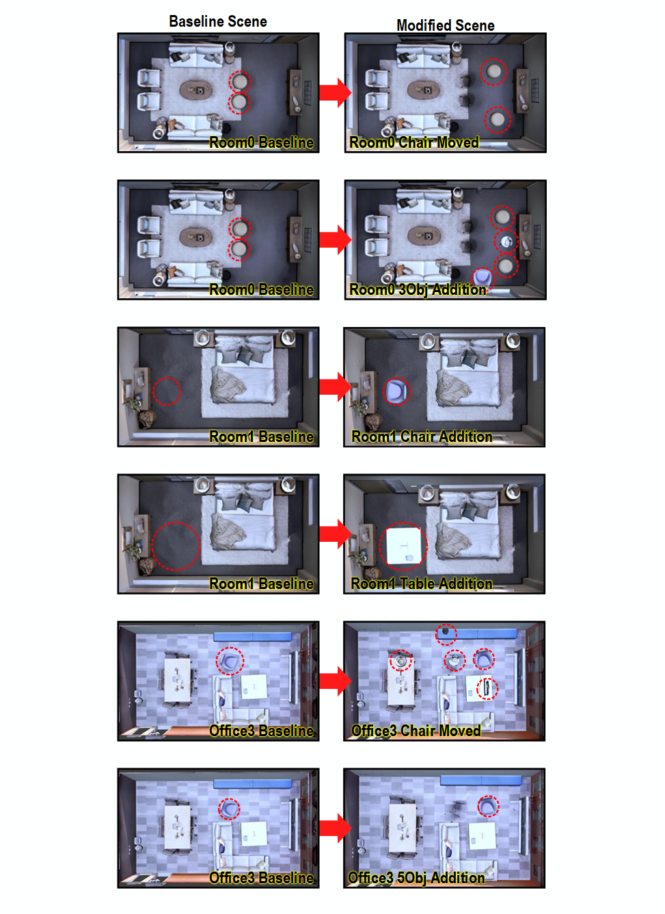

# Semantic Replica

The original [Replica dataset](https://github.com/facebookresearch/Replica-Dataset) provides data for static indoor scenes. However, real-world indoor environments change over time. To address this, we extend the Replica dataset by introducing variations in objects within the scenes.

<p align="center">
  
</p>

To represent relationships between objects in the modified scenes, we adapt the concept of [Scene Graph](https://arxiv.org/pdf/2101.06894). The scene graphs are obtained by applying the [3DSSG](https://github.com/ShunChengWu/3DSSG) network, which performs inference on learned 3D Gaussians from the images included in this dataset. The extracted graphs are then structured to match the input format required by [GAT](https://github.com/codexxxl/GraphVQA).

Furthermore, we generate question-answer pairs for the modified scenes, thereby providing a Replica-based dataset that can also be directly used as input to the [GAT](https://github.com/codexxxl/GraphVQA).

## Semantic Replica

### Dataset Format
Each custom scene contains the following assets:
```bash
data/
├── <scene_name>/
│   └── gt_images/
│       └── images_001.png
│       └── ...
│   └── <scene_name>.blend
│   └── instructions.json
│   └── scengraphs.json
```
Each of the following files serves to represent the scene: 
| File | Description |
|------|-------------|
| `gt_images` | A collection of 2D original images of the scene. Can be processed with COLMAP and used for [3DGS](https://github.com/graphdeco-inria/gaussian-splatting). |
| `<scene_name>.blend` | An editable Blender project containing geometry, materials, and textures. Can be used for visualization and further scene modifications. |
| `instructions.json` | An instruction set describing commands or actions. Can be fed into question-answering tasks by [GAT](https://github.com/codexxxl/GraphVQA). |
| `scenegraphs.json` | A graphical representation of the scene. The relations are generated as result from the [3DSSG](https://github.com/ShunChengWu/3DSSG) network. Also fed into question-answering tasks by [GAT](https://github.com/codexxxl/GraphVQA). |

### Details of Dataset
Here is the list of modified scenes included in this dataset. The details of each scene are as follows:
| Modified Scene | Description |
|----------------|-------------|
| `room0_chair_moved` | In `room0`, two brown stool of the center have been moved to right. |
| `room0_3obj_addition` | In `room0`, two brown stool of the center have been moved to right. And a blue chair, and white table have been added near the stools. |
| `room1_chair_addition` | In `room1`, a blue chair has been added to left of the scene. |
| `room1_table_addition` | In `room1`, a whit table has been added to left of the scene. |
| `office3_chair_moved` | In `office3`, a blue chair of the center has been moved to right. |
| `office3_5obj_addition` | In `office3`, a blue chair of the center has been moved to right. And a white vase, black pot, white table, and monitor have been added near the chairs. |

## Download

```bash
pip install gdown
gdown 1G9ar9ZBQ5r_Cpl6UIhuzqSf4W8vfdiuC -O data.zip
unzip data.zip
```
## License
The data are released under the MIT license.

Copyright (c) 2025 SeryeongKim
